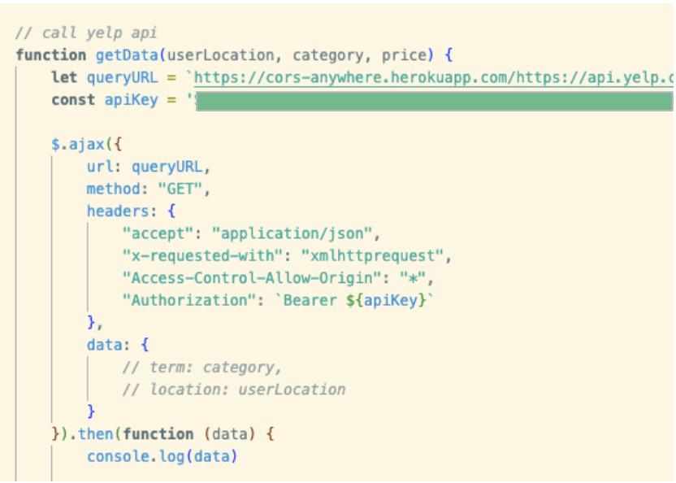

# Yummy App

## Description

The Yummy App was created to make finding restaurants in your city or zip code simple, easy, and quick to use. It provides reliable information about restaurants based on location from user-generated inputs. 
 
It’s ideal for users looking for quick recommendations of where to eat depending on their desired food category and price point. 
Once a user inputs their specified categories, they are also able to see a map with pins of restaurants in the area the user selects.

The restaurant information is provided by the Yelp API which includes restaurant name, address, link to Yelp page, price, number of reviews, and rating out of five. 

Website link: https://genrosales11.github.io/Yummy-app/

* Please go to https://cors-anywhere.herokuapp.com to request temporary access to the Yelp API. Application will not work until activated. 

## installation

* Runs in the browser
* Git clone - git@github.com:genrosales11/Yummy-app.git

### Technologies Used

The Yummy App was built using the following technologies:

* HTML
* CSS
* Javascript
* jQuery
* Bulma CSS framework
* Google Maps API
* Yelp API
* Chroma.js

### User Stories

We came up with three user stories to help guide the direction of our application. Those three included:

* As a stay-at-home parent, I want to easily find restaurants near me, so I can spend more time focusing on my family instead of cooking.

* As someone who has a budget, I want to search for budget friendly restaurants so that I can eat delicious food and stay within my budget.

* As someone who is not sure what to eat, I want to see a drop down menu of different food options so i can see different food categories.

### API Functionality 

Our user stories influenced our API functionality and user inputs that connect to the output values from our APIs. 

The text form allows the user to input their location or zipcode that is nearest to them. They can then choose from a list of categories that they are craving, and choose the pricing amount on how much they would like to spend. 

#### Yelp API

When a user inputs their desired location, price, and meal category, a set of five cards are generated that match that criteria. They are then able to choose which restaurant to go to with the information displayed. They can use the provided address and also go to the linked Yelp page to read reviews and see the menu.

(add gif of card population)

#### Google API

When a user inputs their desired location, price, and meal category, the google map with populated with five locations on the map. They can click on the pin and see exactly where the five returned restaurants are in direct relation to their current location.

(add gif of map populating)

### CSS Framework
 
 * The application has responsive layout that adapts to different screens
 * Easy to navigate for all users
 * Bulma for Site Features: Dropdown, search form, checkboxes, results card styling & search button 

### New Library ChromaJS
 -Chroma.js is a small-ish zero-dependency JavaScript library (13.5kB) for all kinds of color conversions and color scale
 * Here are a couple of things chroma.js can do for you:
* read colors from a wide range of formats
* analyze and manipulate colors
* convert colors into wide range of formats

### Learning Objectives

Our objective was to learn how to build a functional web application calling multiple api's that was responsive to user input. We also wanted to learn how to use an alternative framework to Bootstrap.

### Future Development

-Show multiple previous searches using Local Storage
-Have a randomizer button
-Multiple category selector from the dropdown to show more results

## Authors

The Yummy App was created by 
Laura Sierra: https://github.com/laurasierra17
Genesis Rosales: https://github.com/genrosales11
Mary Dillon: https://github.com/mardill

(link to github pages)

## License

MIT License

Copyright (c) 2022 genrosales11

Permission is hereby granted, free of charge, to any person obtaining a copy
of this software and associated documentation files (the "Software"), to deal
in the Software without restriction, including without limitation the rights
to use, copy, modify, merge, publish, distribute, sublicense, and/or sell
copies of the Software, and to permit persons to whom the Software is
furnished to do so, subject to the following conditions:

The above copyright notice and this permission notice shall be included in all
copies or substantial portions of the Software.

THE SOFTWARE IS PROVIDED "AS IS", WITHOUT WARRANTY OF ANY KIND, EXPRESS OR
IMPLIED, INCLUDING BUT NOT LIMITED TO THE WARRANTIES OF MERCHANTABILITY,
FITNESS FOR A PARTICULAR PURPOSE AND NONINFRINGEMENT. IN NO EVENT SHALL THE
AUTHORS OR COPYRIGHT HOLDERS BE LIABLE FOR ANY CLAIM, DAMAGES OR OTHER
LIABILITY, WHETHER IN AN ACTION OF CONTRACT, TORT OR OTHERWISE, ARISING FROM,
OUT OF OR IN CONNECTION WITH THE SOFTWARE OR THE USE OR OTHER DEALINGS IN THE
SOFTWARE.
